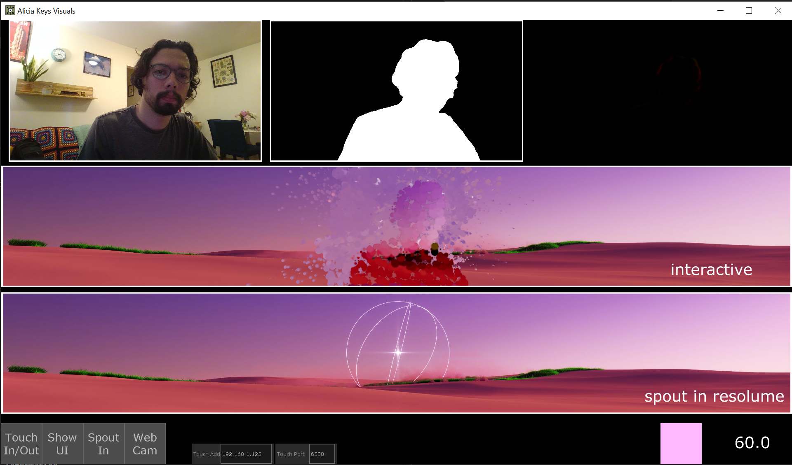
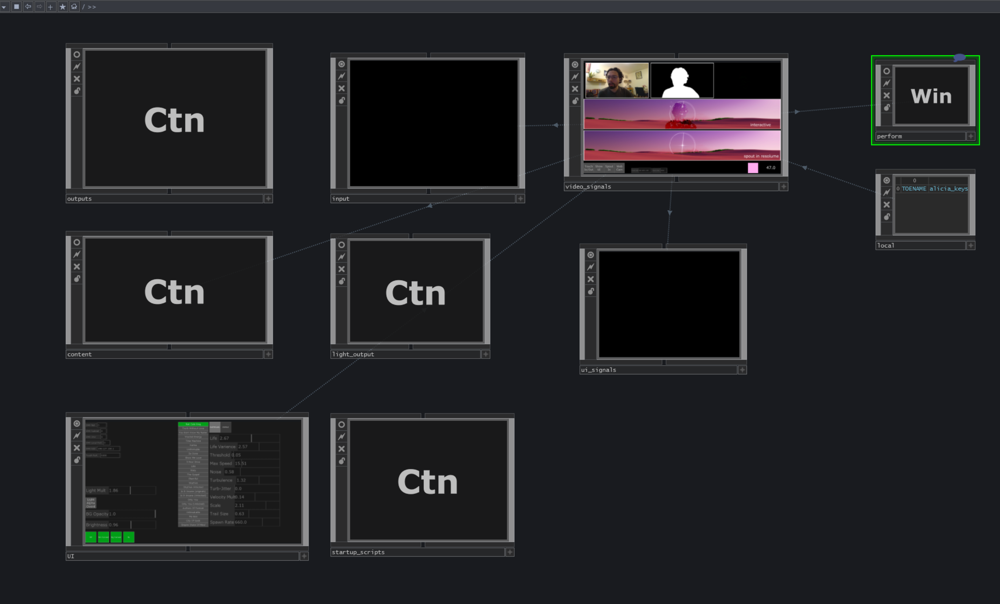
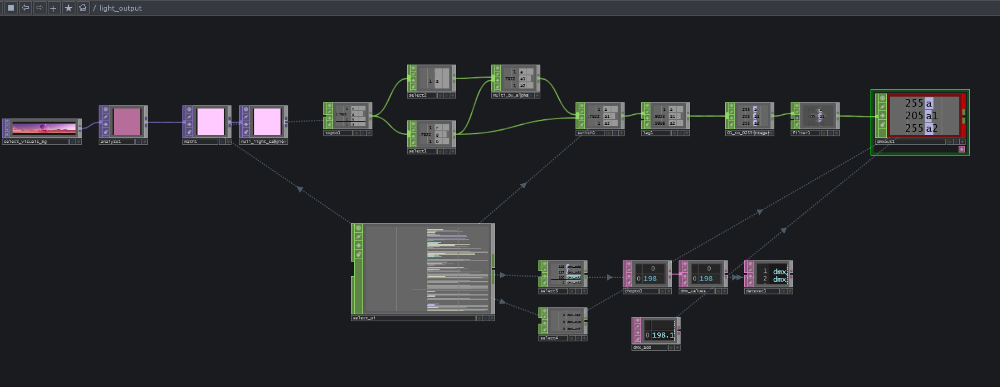
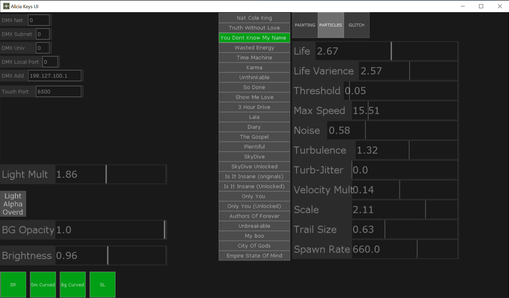

# Alicia Keys Visuals
This repo contains two TouchDesigner apps for the interactive graphics **(alicia_keys_visuals)** and UI **(alicia_keys_ui)** for ALicia Keys 2022 Munich show. 

## TouchDesigner Version
Build 2021.16410

## Alicia Keys Visuals App Functionality
The alicia_keys_visuals app sends video signals to a corresponding Resolume Arean 7 app and also receives incoming video signal from it. 

At the top of the panels we can see three different feeds from the camera. The left most feed is the un treated camera feed. The middle feed is the silhouette extract from the raw camera feed. An NVIDIA RTX GPU is necessary for this AI based extraction. The right most feed is the Optical Flow image of the raw feed. 

The incoming spout signal (labeled as 'spout in resolume') is composited with a SDI camera feed. Several types of visual effects are applied to the the composited contents(labeled as 'interactive') and sent back to the Resolume app.

## UI
* **Touch In/Out:** Toggle on/off UI control from alicia_keys_ui app
* **Show UI:** Shows the local UI panel to be used if the Touch In/Out fails to connect.
* **Spout In:** Activates spout sognals coming from Resolume. If turned off, app will fall back to placeholder video.
* **Web/SDI cam :** Ideally SDI camera will be used; but for debug purposes webcam is also available.
* **Touch Add :** Local (ideally static) ip address of computer running the UI app.
* **Touch Port :** Port number of Touch Out chop in the UI app. 

 

## Alicia Keys Visuls root level architecture

 

## DMX location

This is were the DMX chop and the light color is calculated.
 

 

## Alicia Keys UI App Functionality
The alicia_keys_ui app is connected to the visuals app via Touch In/Out. The UI app will be run on a separate computer.

## UI
* **DMX Net:** DMX Net value; ideally set to 0
* **DMX Subnet:** DMX Subnet value; ideally set to 0
* **DMX Univ:** DMX Univ value; ideally set to 0
* **DMX Local Port :** DMX local port number; ideally set to 0
* **DMX Add :** An available static ip should be used
* **Touch Port :** Port number to connect the Touch In/Out chops. Must match the port number entered in the visuals app. 

